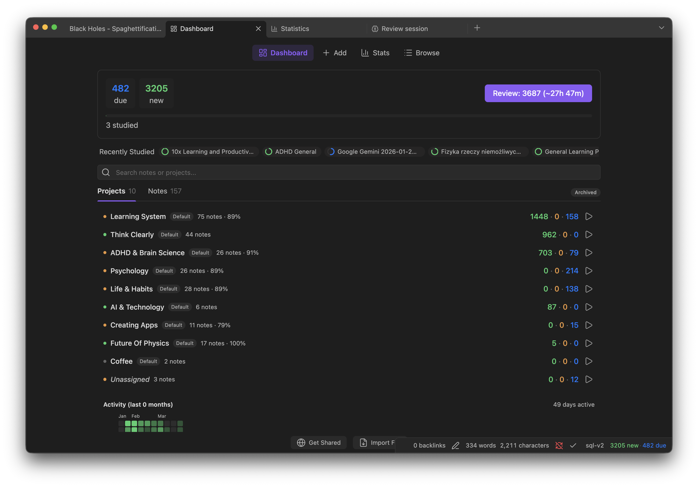
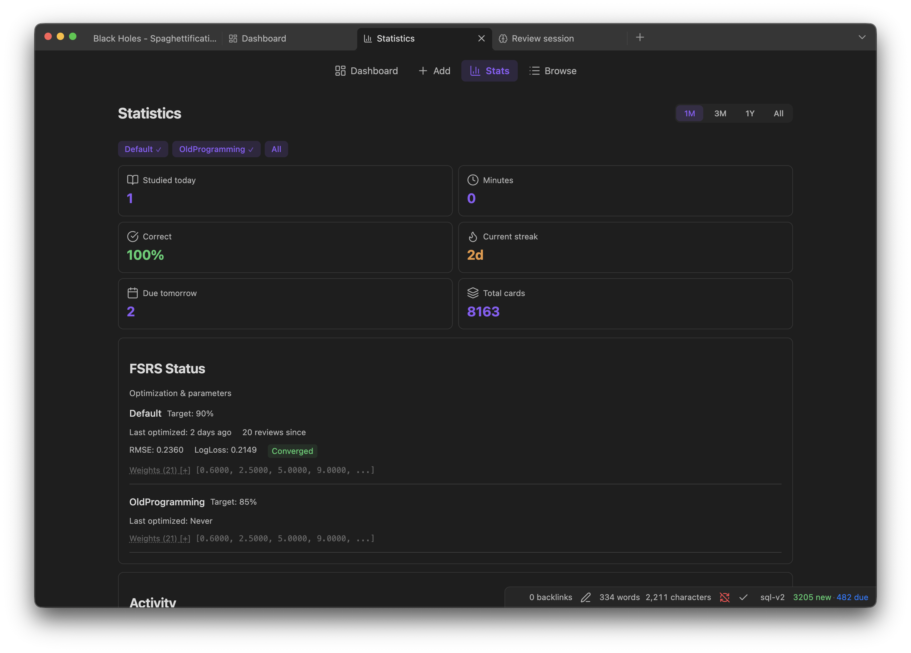
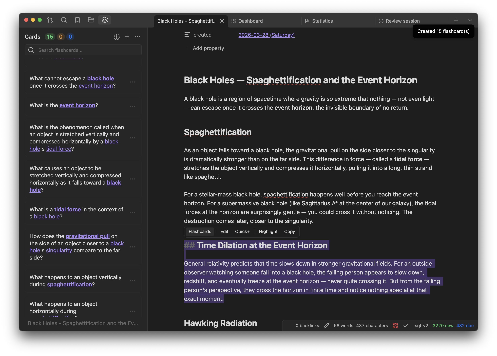
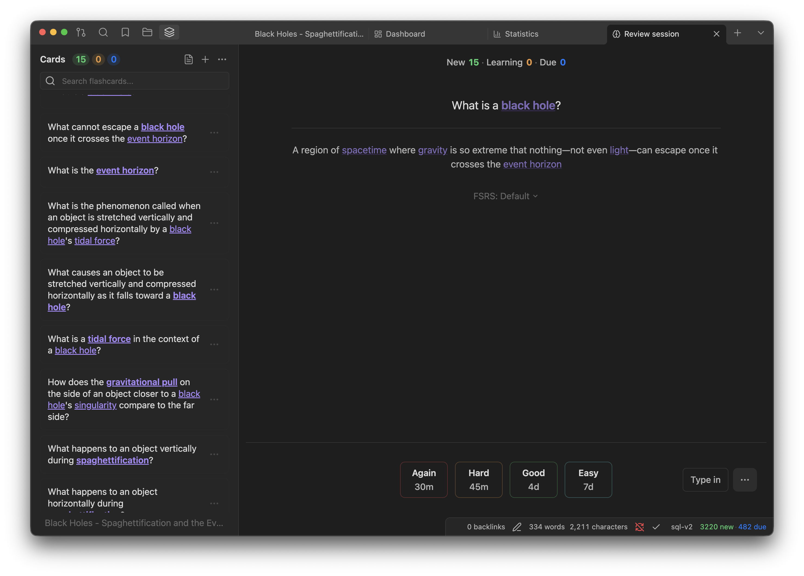

# True Recall

**The next-gen spaced repetition system for Obsidian.**

Create flashcards inside your notes, review them with FSRS v6 scheduling, and track progress with comprehensive analytics, all without leaving Obsidian. Works on desktop and mobile.

[Documentation](https://www.truerecall.app/) · [Pricing](https://www.truerecall.app/pricing/) · [Sponsor on GitHub](https://github.com/sponsors/pieralukasz)

---






---

## Features

- **FSRS v6 Algorithm**: State-of-the-art spaced repetition with 21 trainable parameters. Optimizes to your personal memory patterns after 400+ reviews.
- **AI Workspace**: Select text, get instant flashcards, or polish existing cards through presets. Every AI request becomes a thread you can apply, reject or retry from the AI Inbox. Bring your own key (OpenRouter, LM Studio, custom endpoint) or use True Recall Pro.
- **Local-First Storage**: All data in a portable SQLite database inside your vault (`.true-recall/`). Your data stays with you.
- **Projects System**: Organize cards across notes with many-to-many relationships. Review by topic, inherit FSRS presets from parent projects.
- **Anki Compatible**: Import `.apkg` decks and export to Anki or CSV/TSV.
- **Analytics & Widgets**: Dashboard, statistics, calendar heatmap, forecast charts, and 25+ inline codeblock widgets you can embed in any note.
- **Card Browser**: Powerful query syntax for finding cards by state, properties, source note, and more.
- **Typed Answers**: Type answers and get a teacher-style verdict from AI grading, or diff-based checking without AI.
- **Cross-Device Sync**: Account-backed Cloud Sync between devices, or shared-vault sync through iCloud, Obsidian Sync or any file provider. Concurrent reviews merge by replaying the review log through FSRS.

---

## Installation

### From Community Plugins (Recommended)

1. Open Settings → Community plugins → Browse and search for **True Recall**
2. Install and enable the plugin

### Via BRAT (beta builds)

1. Install [BRAT](https://github.com/TfTHacker/obsidian42-brat) from Obsidian Community Plugins
2. Settings → BRAT → Add Beta Plugin → enter `pieralukasz/true-recall`
3. Enable True Recall in Settings → Community plugins

### Manual

1. Download the latest release from [GitHub Releases](https://github.com/pieralukasz/true-recall/releases)
2. Copy `main.js`, `styles.css`, and `manifest.json` into `<your-vault>/.obsidian/plugins/true-recall/`
3. Enable the plugin in Settings → Community plugins

### From Source

```bash
git clone https://github.com/pieralukasz/true-recall.git
cd true-recall
bun install
bun run build
cp main.js styles.css manifest.json <your-vault>/.obsidian/plugins/true-recall/
```

### Requirements

- Obsidian 1.11.4+ (required for secure session storage through the SecretStorage API)
- Desktop (Windows, macOS, Linux) and mobile (iOS, Android). Phone and tablet layouts are supported since 2.2.0.

---

## Quick Start

1. **Open a note** and select some text
2. **Use the selection toolbar** to generate flashcards with AI
3. **Open the Flashcard Panel** to see and collect your cards
4. **Start a review session** and rate cards as Again, Hard, Good, or Easy
5. **Track progress** in the Statistics view or embed widgets in your notes

For a complete walkthrough, see the [documentation](https://www.truerecall.app/).

---

## Privacy & Background Activity

True Recall is local-first. It does not send telemetry or analytics. Network access is limited to the explicit feature paths below.

**Periodic timers (`setInterval`), all local, no network:**
- Database safety-flush: writes pending changes to the local SQLite file in your vault.
- Optional background backup: writes a backup file inside your vault when enabled in settings.
- Device-lock heartbeat: updates a small lock file inside your vault to prevent two Obsidian Sync clients from corrupting the database when both are open. Local file write only.
- UI status polling: reads in-memory state to refresh diagnostics/backup panels.

**Network requests, only on explicit user action or one-time per release:**
- Update check: when the plugin version differs from the last seen version, a single `requestUrl` call is made to the GitHub Releases API to fetch release notes. Runs once per version, not on a timer.
- AI features (opt-in): flashcard generation, semantic grading, and image-occlusion detection require a configured AI provider. Depending on settings, requests can go to OpenRouter, `ai.truerecall.app` for True Recall Pro, a local LM Studio/Ollama endpoint, or a custom OpenAI-compatible endpoint you enter.
- Local API server (desktop, opt-in): binds to `127.0.0.1` only, used by the optional companion CLI and MCP server. It is disabled by default and does not expose a public network listener.
- External links: documentation, pricing, sponsorship, Discord, and Anki shared-deck links are opened only when you click UI links.

- Cloud Sync (opt-in): when you sign in with a True Recall account and enable Cloud Sync, notes, note types, cards and review logs are exchanged incrementally with the True Recall sync service. The device session is stored in Obsidian SecretStorage and can be revoked from Settings.

**Storage:** All flashcards and review data live in a SQLite database inside your vault. In Shared Vault mode it is `.true-recall/true-recall.db`; in Cloud Sync and single-device modes the per-device database lives in `.true-recall/local.nosync/`, which iCloud does not sync. Backups live in `.true-recall/backups.nosync/`. Device identity uses Obsidian's per-vault local data so multiple synced devices can avoid database conflicts.

**Vault and clipboard access:**
- Vault reads/writes are core to the plugin: True Recall reads selected/current notes, creates or updates notes for projects/imports, and stores its SQLite database and backups inside the vault.
- Vault enumeration is used for note pickers, project discovery, media lookup, and export/import.
- Clipboard writes happen only from explicit copy actions. Clipboard paste/drop handlers are used only in image/media workflows initiated by the user.

**Bundled runtime components:**
- The plugin embeds `@sqlite.org/sqlite-wasm` so SQLite works locally in Obsidian. This is the expected `.wasm` module in the bundle.
- Base64 encoding is used to pass selected vault images to configured AI vision providers for image-occlusion region detection. It is not used to hide network destinations or source strings.

---

## License

Source-available under the [PolyForm Strict License 1.0.0](LICENSE)
(SPDX: `PolyForm-Strict-1.0.0`).

Permitted: noncommercial use, including personal study, research, hobby
projects, and use by charitable / educational / public-research / government
organizations. Fair-use rights are preserved.

Not permitted under this license: redistribution, modification and derivative
works, commercial use, hosting as a service, or building a competing product.

**Commercial licensing.** A separate commercial license is required for any
use beyond what PolyForm Strict allows, including production deployments
inside a business, paid services built on True Recall, or distributing
derivative works. Contact `pieralukasz@gmail.com` to discuss terms.
